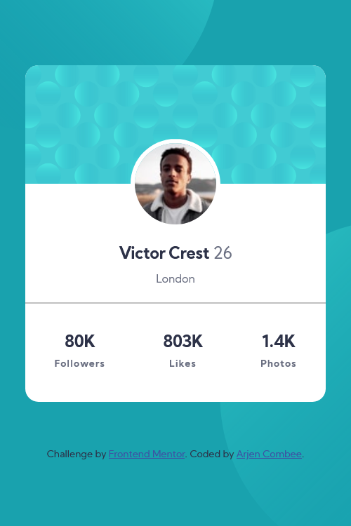

## Overview

### The challenge

- Build out the project to the designs provided

### Screenshot


_taken 2021-04-02_

### Links

- Solution URL: [Add solution URL here](https://your-solution-url.com)
- Live Site URL: [Solution on showcase](https://simpels.nl/showcase/001_profie_card/)

## My process

This was my first project after learning (
self taught) the basics of HTML, CSS and Javascript.

### Built with

- Semantic HTML5 markup
- CSS custom properties
- Flexbox
- Mobile-first workflow

### What I learned

Watching and reading tutorials and coding along is safe and nice. Once you code without help you need to shift gears 😀.
Searching documents, finding own solutions is fun and you learn new stuff too.

**Part of the statistics section**

```html
<div class="stats-list">
  <div class="stats-item">
    <div class="count">80K</div>
    <div class="label">Followers</div>
  </div>
  ... ...
</div>
```

**Placement of photo in middle of card**

```css
.profile-photo {
  display: block;
  position: absolute;
  border-radius: 50%;
  width: 30%;
  border: 5px solid #fff;
  left: 50%;
  top: 50%;
  transform: translate(-50%, -50%);
}
```

### Continued development

I will focus on placement of background images (svg's) and how they must/can change accordinly to screensizes.

### Useful resources

## Author

- Website - [Arjen Combee](https://arjencombee.nl)
- Frontend Mentor - [@ArjenCombee](https://www.frontendmentor.io/profile/ArjenCombee)

## Acknowledgments

I want to say a big thank you to people who are responible for my **junior junior skills** in webdevelopment:

- Brad Traversy - [Traversy Media](https://www.traversymedia.com/)
- Jonas Schmedtmann - [Codingheroes](https://codingheroes.io/)
- Kevin Powell - [Kevin Powell on youtube ](https://www.youtube.com/kevinpowell)

♥ Thanks
